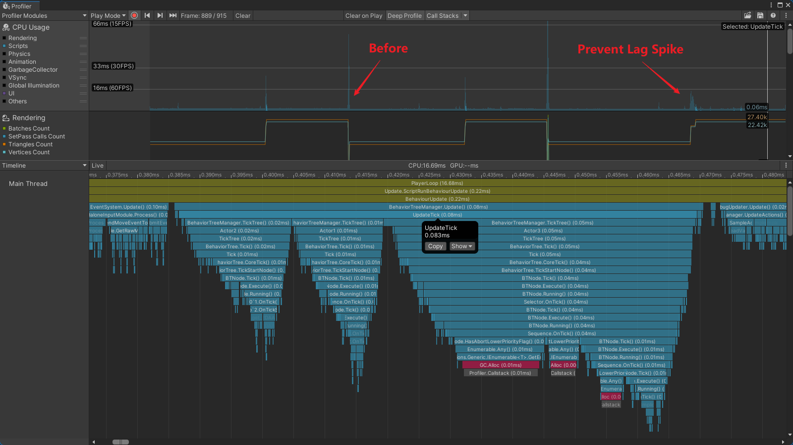
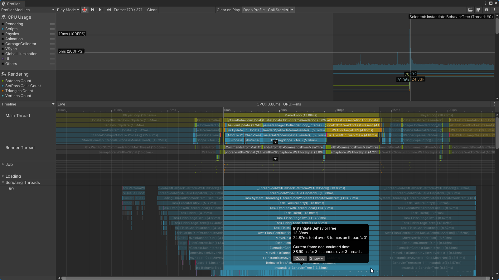
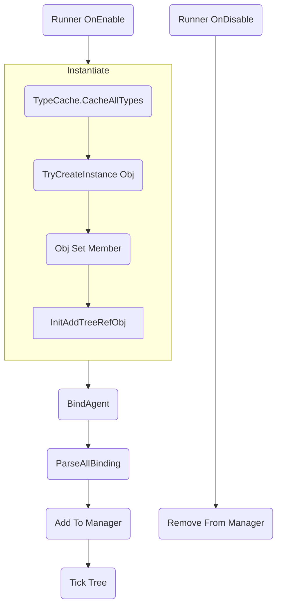

# 优化
这篇文档讨论如何处理尖峰帧卡顿(lag spike)。  
  


## 实例的执行过程




## 性能开销来自哪里
- 静态成员初始化
- 实例化对象
- 反射调用  
  目前反序列化是基于反射实现的，所以卡顿的主要原因是反射调用。  
- 轮询更新树
- 数据结构Resize
- Log节点开销很大 (1ms~100ms)  
- 行为树编辑器Debug模式窗口，建议查看性能时关闭行为树编辑器。  

## 核心API
- TypeCache.CacheAllTypes (100ms~500ms)  
  缓存AppDomain所有程序集所有类型全名，用于加速后续反序列化时类型查找。  
- TypeCache.TryMakeArrayType / TypeCache.TryMakeGenericType (1ms~20ms)  
  生成泛型特化类型，这些类型在程序集里不存在，只有运行时才存在。  
- Activator.CreateInstance (1ms~20ms)  
  反射创建实例对象。大量节点对象，RefVar对象等。  
  内部触发了RuntimeType.CreateInstanceMono，第一次反射调用构造函数需要大量时间。  
- TrySetMemberValue (10ms~100ms)  
  反射为对象成员赋值。  
  需要反射访问所有成员，内部触发了RuntimeType.GetMembers，找到对应的成员并反射赋值。Mono似乎没有缓存结果，后续调用也特别耗时。  
  - Type.GetMembers(1ms~20ms)  
  - FieldInfo.SetValue  
  - PropertyInfo.SetValue
- CreateDelegate (1ms~20ms)  
  将字段属性方法封装为委托。主要封装Get Set。  
- Attribute.GetCustomAttribute (1ms~20ms)  
  内部触发RuntimeType.GetCustomAttributes。每个成员第一次反射调用需要大量时间。Mono似乎没有缓存结果，后续调用也特别耗时。  


## 性能分析器标记
Profiler.BeginSample 使用 [Conditional("ENABLE_PROFILER")]，可以任性的随意添加到代码中。    

Unity.Profiling.ProfilerMarker 没有 Conditional 特性，建议性能敏感区域，使用条件编译调用。  

```cs
protected static readonly Unity.Profiling.ProfilerMarker ProfilerMarker = new("MyMarker");

public void Test()
{

#if ENABLE_PROFILER || UNITY_EDITOR || DEVELOPMENT_BUILD
    using var profiler = ProfilerMarker.Auto();
#endif

}
```

# 哪些疑点并没有导致性能问题
经过调查和测试，以下猜测并没有造成性能损失。  
- 内部函数  
  怀疑ObjectData.TryDeserialize.TryDeserializeMember内部函数会导致大量的`Mono.JIT`。  
- 程序第一次运行  
  程序第一次运行会额外触发代码优化吗？结论不会，多次运行性能一致。  

## 为什么出现尖峰帧卡顿(lag spike)
在.NET中，反射第一次调用时很慢，第二次就足够快了。所以第一次初始化比较慢是预期之中的。

[Mono.JIT
Mono-only	Contains samples that relate to just-in-time compilation of a scripting method. When a function is executed for the first time, Mono compiles it and Mono.JIT represents this compilation overhead.](https://docs.unity3d.com/Manual/profiler-markers.html)

在Mono后端和编辑器中，Profiler中，第一次反射调用显示为Mono.JIT，汇总显示总消耗在200ms~500ms，也就是说第一次调用反射的额外开销在200ms以上。  
这些开销在IL2CPP中也是存在的，显示为xxSlow，xxMono，这一类的方法。  
这些是可以通过预调用优化的。  

Tick环节，RefVar implicit 第一次隐式转换，Get，Set，也会触发Mono.JIT。  

在插件的架构设计中，不能要求用户在使用之前，必须要执行若干初始化代码。  
使用方法必须是开箱即用的，保证艺术家和独立开发者可以在不修改代码的情况下工作。  
整个架构设计就是延迟初始化的，也是为了防止不必要的额外调用。  
所以第一次实例化过程中，会有很多很多反射调用被触发，造成尖峰帧卡顿。  

## 需要处理的位置

- 全局第一次实例化
- 树文件第一次实例化为树实例
- 节点类型第一次实例化
- 树实例第一次Tick
- 树实例Tick

## 优化思路
- 优化代码架构和实现方法，减小性能开销  
- 将耗时大的执行过程分散到多个帧执行（预热warm up 和 分帧）  
- 多线程  

## 预期目标
第一次初始化耗时小于20ms。  
后续初始化耗时小于10ms。  

## 优化实现
- 提前访问静态类型，触发静态成员初始化。例如TypeHelper。 
- TODO: UnityTraceListener构造耗时严重，考虑池化。  
- 实例化后下一帧在加入Manager，实例化和第一次Tick尽量不要再同一帧执行。  
- 为高频调用反射函数创建缓存。  

在项目中，已经内置了大量预热代码。  
可以在合适的位置调用PreventLagSpike.WarmUpAll。   
**`也可以打开RuntimeInitializeOnLoadMethod特性，这样程序启动时自动预热。`**  
使用多线程预热更合适，但是无法确定预热完成时间。  

同时建议打开异步初始化，对消除尖峰帧卡顿非常有帮助。
- AsyncInit
- BeforeBindAgentDelayFrame
- BeforeParseBindingDelayFrame
- DelayMinFrame  

副作用是行为树不会再当前帧立刻开始执行。  


参照PreventLagSpike作为示例，用户可以自行预热自定义类型。  
也可以有选择的调用各个预热子函数。  

目前PreventLagSpike.WarmUpAll大约耗时1000ms~1500ms。
- 在PC Intel(R) Core(TM) i9-10850K CPU @ 3.60GHz   3.60 GHz  大约耗费 1000ms+
- 在Android Redmi Note 12 Turbo 第二代骁龙7+ 八核2.91GHz
  - IL2CPP 3000ms+ 
  - Mono 6000ms+
- 在Nokia N1 
  - IL2CPP 50000ms+ 
  - Mono 测试场景没有成功运行。

预热不是越多越好，需要根据项目具体分析。  
所以预热代码默认是关闭的，由用户根据需求开启。 
强烈建议使用多线程预热，使用多线程预热更合适，但是无法确定预热完成时间。   

TrySetMemberValue.cs有许多注释掉的性能分析器标记，根据需求打开使用。  

在合适的位置，例如Loading时，后台或者多线程为每个树文件预先实例化一次，这种方法也是可行的。  


注意：创建缓存是以增大内存为代价的，而且可能会因为缓存过时，引入bug。  


# 参考链接
- [Why is reflection slow?](https://mattwarren.org/2016/12/14/Why-is-Reflection-slow/)
- [Warm-up when calling methods in C#](https://stackoverflow.com/questions/4446203/warm-up-when-calling-methods-in-c-sharp)
- [Playing with your member](http://marcgravell.blogspot.com/2012/01/playing-with-your-member.html)
- [Marc Gravell / fast-member](https://github.com/mgravell/fast-member)


