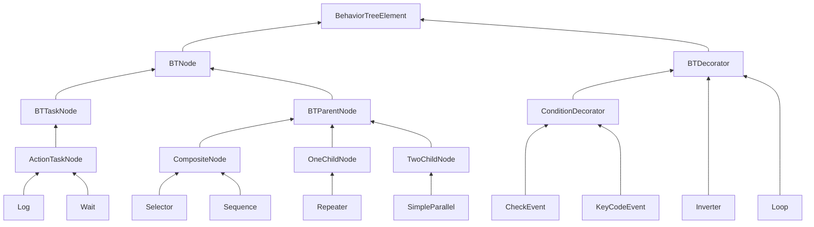
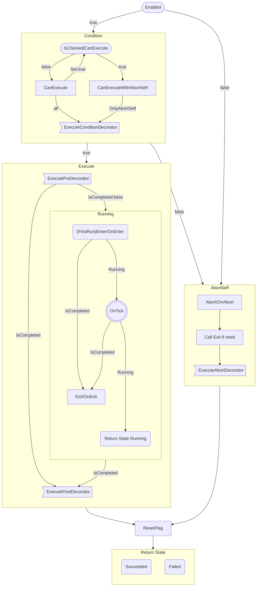

# 技术细节

- 使用UIElement构建的编辑器。
- 完整的C#代码，所有代码都是可见的，没有dll。
- 针对接口设计的架构，完全与业务逻辑解耦，更好的扩展性。
- 快速拆分内联子树，更好的分解和复用AI逻辑。
- 充分的性能优化，满足绝大多数游戏需求。
- 清晰的代码架构，完全模块化代码。
- 灵活的参数绑定，允许手动修改绑定路径。

## 解决了其他行为树的哪些痛点？
- 绑定问题
  - 其他行为树只能绑定到已有组件上
  - 而我的实现，支持更复杂的绑定，即使组件不存在。
  - 可以绑定到字段属性，方法等。
  - 可以绑定到接口。这样做的好处时，如果想要做mod，公开AI部分。不需要公开Agent代码，仅公开Agent支持的接口就可以了。
- 不需要SetValue
  - 基于轮询驱动的，条件节点会自己去访问绑定的值。在Agent侧，不需要频繁的SetValue来触发行为树。
  - 所以也去掉了黑板，Agent和行为树不在需要中间层。
- 泛型节点（目前仅运行时支持）
  - 不需要创建大量重复或者相似节点。
    例如MoveTo，Follow，Patrol，三个节点都是移动相关。
    参数可以是Vector3，也可以是GameObject，或者transform。
    Agent移动方式可以是NavAgent,也可以是CharatorControllor。
    排列组合会有大量节点产生。泛型节点可以解决这个问题。
- 节点自适应
  - 开发调试，甚至版本变更时，可能会临时关闭某些节点，或者节点失效。节点自适应，可以在修改行为树连线的情况下，忽略特定节点，就想这个节点不存在一样。
- 任意节点都可以作为开始节点。
  - 其他的行为树可能有专门的开始节点。
  - 这样做的的优点的，调试时可以只应用一个行为树的局部分支。非常有用。
- Goto
  - 允许节点直接访问其他节点。
  - 有利有弊的一个功能。带来了灵活性。
  - 可以不用，但是不能没有的功能。
- 子树
  更好的解决逻辑复用问题

## 依赖
- "com.unity.settings-manager": "1.0.3"

1. 在Unity中打开Window -> Package Manager。
2. 点击左上角的“+”并选择“Add package by name”。
3. 输入UPM包的名字，版本可选填。
4. 点击“Add”按钮，等待Unity下载和安装UPM包。

## 基础功能

* [x] 基础节点库实现
  * [x] 为Unity默认组件生成节点
  * [x] 视觉听觉感知组件

+ [x] 公开参数绑定
+ [x] List Array ~~Dictionary~~
+ [x] 最多2层的嵌套泛型
+ [x] TreeElement循环引用。Task引用其他Task。
+ [x] 预制体可重写参数。

- [ ] 笔记节点StickyNote
- [ ] 组合Group
- [x] 子树
- [ ] 文件变体

+ [x] 增加/删除节点
+ [x] 连接/断开节点
+ [x] 复制/粘贴节点
+ [x] 移动子节点时重新排序子节点

* [x] 有未保存改动时关闭编辑器进行提示
* [x] Undo/Redo 
* [x] 通过节点打开cs文件
* [ ] 通过节点打开节点View文件
* [x] 节点序号

+ [ ] 选中节点时，提示条件终止可影响的节点

* [ ] TwoChild节点创建特有的节点View

- [x] 保存为ScriptObject文件
- [ ] 保存为Json文件
- [x] 自动使用编辑器打开文件
- [x] 生成行为树代码，消除反射，消除绑定
- [ ] 扫描所有行为树用到的类型，生成TypeCache.Hot静态方法代码。

+ [x] 保存编辑器用户偏好设置
+ [x] 编辑器Log可选设置
+ [ ] 多语言Log

- [x] 每个行为树文件和实例独立编辑器窗口
- [x] 调试
- [x] 支持多个实例同时调试
- [ ] 远程调试
- [ ] 游戏内实时编辑器/行为树查看器。（目前GraphView只支持编辑器，等unity realtime支持时迁移）

# 架构细节

## 架构图



## 节点函数的执行顺序
Tick函数内部大致调用过程，具体细节请阅读源码。



## 初始化


BindAgent,ParseBinding 在 Awake前执行。  
BindAgent,ParseBinding被看作反序列化的一部分，Awake可能会用到一些序列化的成员，至少会用到GameObject。  


## 装饰器

本库采用的设计是，装饰器放在Task内部，并认为装饰器是Task的一部分。  
依据是：在状态机中，条件节点从来就不是一个状态，而是一个过渡，过渡不是一等成员，不能独立存在与状态机中，只能依附于状态节点。  

~~笔者认为行为树将条件节点作为执行节点放在树中是一个失败设计。~~

采用了装饰器放在Task内部的设计，那么有下面2种设计：  
1. 先判断条件后进入Task （依据是：装饰器等价于其他行为树中的条件节点，只有经过了条件节点，才能到达Action节点）
2. 先进入Task后判断条件 （依据是：如果不进入Task，那么不应该访问Task内部内容）   

哪种设计更合理？  

目前采用第一种设计方案。

于此同时，装饰器等价于其他行为树中的 条件节点/控制节点。所以装饰器成员结构上与Note相似，同样含有GUID等成员。

- [x] `条件装饰器` 用C↓表示，从上到下执行 用于判断节点能否进入  
- [x] `前置装饰器` 用F↓表示，从上到下执行 在进入节点前调用  
- [x] `后置装饰器` 用B↑表示，从下到上执行 在退出节点后调用  
- [x] `终止装饰器` 用A↑表示，从下到上执行 在终止节点发生时退出节点后调用  

+ 如果`条件装饰器`没有通过，则不会执行节点。前置装饰器，后置装饰器，终止装饰器都不会被执行。  
+ `后置装饰器`和`终止装饰器` 不会被同时执行。  
  但是节点本身的OnAbort OnExit都会被执行。  
  Abort时调用顺序 OnAbort --> (如果执行过Enter)Exit --> `终止装饰器`  

## 子树
使用Subtree节点，可以引用另一个行为树文件，作为子树使用。  
- 内联  
  将子树节点的行为树节点内联到当前树中，并使用子树的开始节点，取代子树节点。  
  内联时所有子树节点的GUID都会更新为新值，防止GUID冲突。  
- 导出  
  选中一个节点，将该节点和它的子节点导出为一个新的行为树。  
  所有导出的节点GUID都会更新为新值，防止GUID冲突。  
  主要是防止用户导出后又进行Undo操作，会导致出现相同GUID的节点。  
  由于架构设计原因，无法分析参数表与节点的引用关系，引用的参数表参数不会跟随导出到新树中。  

`注意：内联和导出都是高危操作，非常容易对行为树文件造成不可逆更改。强烈建议在操作前使用版本管理工具。`

## 多态序列化和泛型序列化

- 多态序列化可以使用，但是如果注意，如果直接清除序列化对象，重新赋值新对象时，rid会改变。  
  直接修改原对象时rid不会改变。
- 泛型序列化unity2023才开始支持。插件主要支持版本还是2021，现阶段不能依赖于这个功能。所以还是要泛型特化。

## 参数绑定
参数绑定涉及到的4个功能是`正交`的。  

1. 包含一个基础值，作为普通成员来使用。
2. 包含一个Path，纪录绑定到Agent的某个组件的成员。  
   包含一个ParseMode，用于在解析绑定失败时的行为，包括Log，抛出异常，回退到基础值，回退到类型默认值。
3. 包含一个RefName，可以存放到参数表集合中，也可以在多个节点上共享。也可以看作这个成员值引用了一个参数表中的值。
4. AutoConvert，存放一个参数引用，引用的参数类型可以和声明类型不一致，使用自动转换器来匹配。

本库通过继承逐步递进实现了4种功能参数。节点的成员值可以声明为这4种。  
如果使用1和2的类型，序列化是直接序列化到节点本身的，等同于内嵌到节点的，不与节点外界发生关系。  
如果使用3和4的类型，参数是序列化到树的参数表中的，在节点本身只序列为引用Name，实例化时通过搜索参数表中的参数，赋值给成员。

## AutoConvert
自动类型转换存在2个部分。
- 参数实例Path可以绑定到与参数声明类型不同的Agent的某个组件的成员。  
- TODO: 节点成员值可以引用参数表中与成员声明类型不同的参数实例。  

显而易见的是，转换次数越多，性能越低。

## 类名变更
- 序列化成员更改命名。保证仍能反序列化成功。 
    - 支持FormerlySerializedAsAttribute特性
    - 支持SerializationAliasAttribute特性
- 节点更换类名   
    - 使用SerializationAliasAttribute特性标记在类型上，注意别名一定是旧的类型全名，包含命名空间。  
    编辑器会自动查找SerializationAlias保证旧的文件仍能反序列化成功。重新保存后变更为新名字。  
    - 或者手动写一个静态函数，在反序列化前使用TypeCache.HotType设置别名。   

查找特性比较耗时，推荐更换命名后，重新保存下已有的行为树文件，将名字更新。  
如果需要运行时解析旧名字，同理，在游戏开始时，反序列化之前使用TypeCache.HotType设置别名。

## 类型变更
节点序列化成员类型变更时，由于类型不匹配，会导致原有行为树文件反序列失败。  
在成员或者节点类型上使用SetMemberByAttribute，指定一个反射赋值时的回调方法。  
成员回调方法签名是 bool FuncName(object memberValue);   
类型回调方法签名是 bool FuncName(string memberName,object memberValue);  
方法不能是私有的或者静态的。  

## 节点引用
可以在节点中声明引用含有Serializable特性的节点。
使用BindingPathSetterAttribute，则可以在Inspector中选择树种的节点引用。

## 环形拓扑和菱形拓扑
- 环形拓扑本质上已经非常接近分层状态机了，每个组合节点都可以看作一个状态机的层。
- 菱形拓扑可以避免常用逻辑在图中多次复制。  

**运行时的树是没用结构限制的。**  
编辑器限制不允许环形拓扑和菱形拓扑。  
但是用户可以手动编写行为树文件。  
超出树形拓扑会造成蜘蛛网一样的图，失去可读性。用户自行取舍。

## 驱动方式
- 事件驱动(event-driven)
- 轮询驱动(tick-driven)
    - root-leaf  
      从root节点tick到末端leaf节点。优点是实现简单，容易理解。
    - last leaf  
      记录最后执行的leaf节点，每次tick最后的节点。优点是性能更好一点。  
    - active stack  
      使用执行栈的方式记录下次要执行的节点。  

本库使用`轮询驱动root-leaf`模式执行行为树。

Q：为什么不采用事件驱动(event-driven)行为树？  
A：实现起来太过于复杂，涉及到参数绑定值变化时没有办法处理。    

事件驱动实现基础是存在Blackboard，并且Blackboard SetValue触发更新。  
本库不存在Blackboard，绑定后没有SetValue，类似与Lazy模式，每次取值时才计算值，无法触发事件，优点是不用手动SetValue。  
事件驱动优点是性能更高，缺点是因为没有tick所以需要service节点。  
轮询驱动优点是实现简单。  

## 状态切换
Q：节点完成后应该`立刻进入下一个节点`还是`下一次tick才进入下一个节点`？  
A：采用`立刻进入下一个节点`的设计方案。

- 必须保证有一个叶子节点为running状态。  
  如果下一个tick才切换，会导致当前tick，当前节点完成，下一个节点未开始运行。不符合直觉。
- 类比状态机，状态机中不允许某一时刻处于2个状态夹缝状态，总是立刻进入下一个状态。
- 装饰器等同于常规行为树的叶子节点。而且装饰器很难实现下一次tick才进入下一个装饰器。  
  为了保证装饰器和叶子节点的一致性，统一为立刻进入下一个节点。

## 终止
在节点已经开始执行，并且没有完成时，主动结束节点。  
当Abort发生时，递归调用子节点，Abort执行OnAbort Exit AbortDerators。
最终由子到父，依次退出。

## 条件终止

```cs
[Flags]
public enum AbortType
{
    None = 0,
    Self = 1 << 0,
    LowerPriority = 1 << 1,
    Both = Self | LowerPriority
}
```

两种终止类型：  
- Self：当自身处于`Running`时，每次Tick都对含有AbortType.Self的条件装饰器重新求值。如果结果由true变为false，则终止自身节点，节点向父节点返回Failed。
- LowerPriority：当`右侧节点`处于`Running`时，父节点每次Tick会额外对`HasAbortLowerPriorityFlag`的节点重新求值。  
  如果节点的执行结果`发生改变`，则终止处于`Running`的节点。  
  如果节点的执行结果`没有改变`，则继续执行`Running`的节点。  

不要被终止类型的名词误导，不同的行为树实现条件终止的处理方式略有差异。  
但总的来说是都是符合直觉的。可以笼统的理解为，已经处理过的节点条件改变时，允许反悔，重新执行，并结束正在允许的节点。

### 不同的父节点对LowerPriority的处理方式不同。 
- Selector  
  对`HasAbortLowerPriorityFlag`的子节点重新求值。  
- Sequence  
  仅对`HasAbortLowerPriorityFlag`的子节点的`含有AbortType.LowerPriority的条件装饰器`重新求值：  
  - 如果重新求值结果为true，跳过节点本身再次求值，继续执行处于`Running`的节点。  
  - 如果重新求值结果为false，则终止处于`Running`的节点，Sequence直接返回Failed。

### Dynamic
- Dynamic是另一种条件终止的实现方式。  
- Dynamic仅可以标记在父节点上。  
- Dynamic比AbortType性能开销更高，也更不容易理解。  
- **强烈建议使用AbortType，而不是Dynamic。** 但是仍然尊重用户的选择。  

不同的父节点对Dynamic的处理方式不同。  
- Selector  标记为Dynamic  
  每次Tick对所有子节点重新求值。  
- Sequence  标记为Dynamic  
  与`AbortType.LowerPriority`不同。  
  每次Tick对所有子节点重新求值：
  - 如果这个节点Succeeded，则继续执行处于`Running`的节点。  
  - 如果这个节点Running，则终止处于`Running`的节点，改为执行这个节点。  
  - 如果这个节点Failed，则终止处于`Running`的节点，Sequence直接返回Failed。  
  - `特别注意`：如果Sequence含有多个非条件子节点，第一个非条件节点总是会终止后面的非条件节点，并重新运行。会造成死循环。所以如果没有特别需要，不要对Sequence标记Dynamic。  

## Event Trigger
Event和Trigger都是记录在树中的标记。  

- Event生命周期为1个Tick，1个Tick后自动消除。  
  有效期内，任何时刻任何节点检查Event结果都为true。
- Trigger生命周期为永久，直到ResetTrigger。  
  有效期内，任何时刻任何节点检查Event结果都为true。

通常CheckTrigger装饰器可以选择何时ResetTrigger
- Immediate 检测成功后立刻ResetTrigger
- EnterNode 检测成功后如果能成功进入所属节点，ResetTrigger
- LeaveNode 检测成功后如果能成功进入所属节点，离开节点时ResetTrigger

默认是Immediate。  
某些用例，节点上可能有多个条件节点，如果不是所有条件节点都成功，则节点不会进入执行。  
这种情况下可能不希望消耗掉Trigger，则可以设置为EnterNode。  

## 性能
初始化行为树实例可能会消耗大量时间。  
尤其是初始化第一个行为树实例，可能需要初始化很多静态成员，消耗时间可能在100~1000ms，甚至更多。  
建议多线程初始化。  

简单树实例(20个节点以内)，每次Tick大约0.002ms ~ 0.02ms。  
- 行为树越复杂消耗性能越多。  
- 行为树深度对性能影响比较大。
- 出现异常会影响性能。  
- 打印Log会严重影响性能。  

尖峰帧卡顿，个别帧可能消耗10倍以上性能，单个行为树实例执行时间可能超过1ms。  
可能的原因：  
- 绑定参数深度太深。
- 绑定参数过多。
- 条件终止过多。  

*性能与Animator相差太多。Animator保守估计性能也是插件的10倍以上。*  

结论是：  
超出场景范围的对象行为树应该关闭。关闭的行为树不会执行，只会占用内存。  
不应该同时存在过多的行为树实例，建议不超过100个。  

优化：  
- 如果明确行为树不会调用主线程函数，可以考虑手动使用多线程执行。  
- 降低行为树执行频率，每隔固定时间执行一次，将行为树平均分配到多个帧执行。  
- 使用自定义节点，代替通用节点和参数绑定。这对复杂行为树性能至关重要。 
- 生成行为树代码，代替行为树资源文件。  

在服务器中使用行为树：  
如果想在服务器使用大量行为树实例，应该生成行为树代码。  
即使如此，想要在服务器同时执行数千数万的实例，也是难以实现的。  

## 扩展节点
默认节点和默认节点的默认行为参数可能无法满足用户的所有需求。  
由用户根据项目需要扩展节点是非常常见的。  

应当首选从框架提供的基类接口继承。  
如果基类不符合需求，可以考虑通过接口继承。相当一部分功能编辑器是直接通过接口支持。  
如果运气好的话，即使扩展节点缺失了某些接口，框架仍能正常工作。  
随着架构重构，功能总是从基类向接口拆分，耦合越来越低。  

# 最终未采用的设计
## 异步
使用异步API，比如父节点调用子节点等待结果，使用异步代替事件。Running可以使用异步代替。  

实际实现时发现，使用异步就不应该Tick驱动，只有事件驱动才能完全发挥异步的效果。   
这与参数绑定是相互冲突的设计。如果强行使用异步，就要增加一个绑定参数求解器，然后不停的Tick，当参数值发生改变时，发送事件到行为树，模拟事件驱动。
使用异步实现起来更加繁琐。开销更大。所以暂时不采用这种方式。  

---
---
# 参考连接
- https://robohub.org/introduction-to-behavior-trees/


